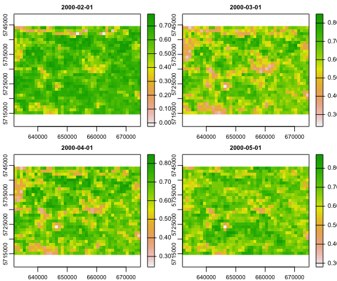
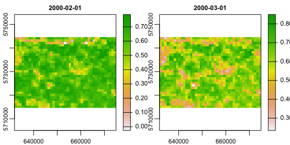
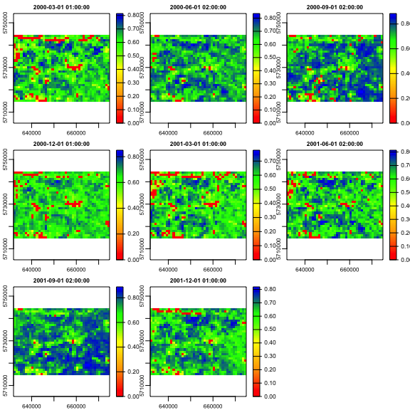
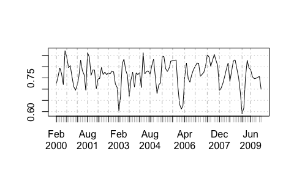
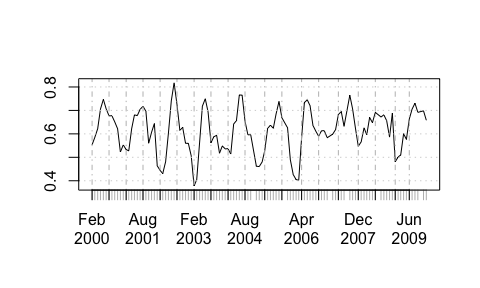
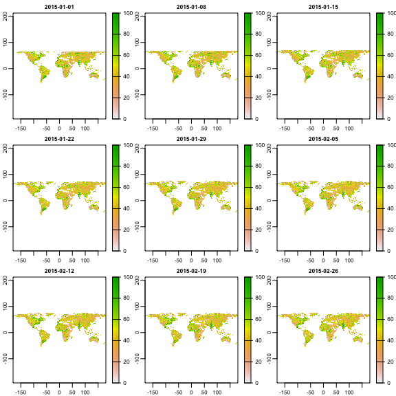

[](https://cran.r-project.org/package=rts) [](https://ci.appveyor.com/project/babaknaimi/rts) [](https://app.travis-ci.com/babaknaimi/rts)

[](https://cran.r-project.org/package=rts)

[](https://cran.r-project.org/package=rts)


## rts: Raster Time Series


‘rts’ is an R package, aims to provide classes and methods for
manipulating and processing of raster time series data. There is already
a very nice package for handling and analyzing raster data
(i.e. package: raster, and terra). Several packages have also been
developed for handling time series data (e.g. xts package). ‘rts’ simply
links ‘raster’/‘terra’ and ‘xts’ packages together to provide new
classes of raster time series data as well as a framework for analyzing
such data.

At the current stage, the package has provided the classes and some
basic functions, but it is under development and will be extended by
adding numerical routines for some specific analysis (e.g., to explpore
ecosystem dynamics using time series of satellite images).

This vignette aims to demonstrate how this package can be used given
some simple examples:

## Creating a raster time series object:

Three classes, namely ‘RasterStackTS’, ‘RasterBrickTS’ (based on a
Raster\* object from the raster package), and ‘SpatRasterTS’ (based on a
SpatRaster object from the terra package) are introduced by ‘rts’
package for handling raster time series data. These classes have a
RasterStack or RasterBrick (introduced by package ‘raster’), or
SpatRaster (introduced by package ‘terra’), and xts (introduced by
package ‘xts’) classes inside. To create either of these classes, you
should have a series of raster files (e.g. satellite images) and the
date/time information corresponding to these rasters. Here is an
example, we have 4 raster files in the format of grid ascii:

``` r
library(rts)
library(terra)
```

``` r
# location of files

path <- system.file("external", package="rts")

# list of raster files:

lst <- list.files(path=path,pattern='.asc$',full.names=TRUE)

lst
```

    ## [1] "/Library/Frameworks/R.framework/Versions/4.1/Resources/library/rts/external/r1.asc"
    ## [2] "/Library/Frameworks/R.framework/Versions/4.1/Resources/library/rts/external/r2.asc"
    ## [3] "/Library/Frameworks/R.framework/Versions/4.1/Resources/library/rts/external/r3.asc"
    ## [4] "/Library/Frameworks/R.framework/Versions/4.1/Resources/library/rts/external/r4.asc"

``` r
# creating a SpatRaster object

r <- rast(lst)

r # a SpatRaster object
```

    ## class       : SpatRaster 
    ## dimensions  : 30, 43, 4  (nrow, ncol, nlyr)
    ## resolution  : 1000, 1000  (x, y)
    ## extent      : 631900.5, 674900.5, 5714611, 5744611  (xmin, xmax, ymin, ymax)
    ## coord. ref. :  
    ## sources     : r1.asc  
    ##               r2.asc  
    ##               r3.asc  
    ##               ... and 1 more source(s)
    ## names       : r1, r2, r3, r4

``` r
d <- c("2000-02-01","2000-03-01","2000-04-01","2000-05-01") # corresponding dates to 4 rasters

d <- as.Date(d)

d # dates correspond to 4 raster layers in R
```

    ## [1] "2000-02-01" "2000-03-01" "2000-04-01" "2000-05-01"

``` r
# creating a RasterStackTS object:

rt <- rts(r,d) # we creater a SpatRasterTS (a raster time series)

# here is the definition:
rt
```

    ## Raster Time Series with monthly periodicity from 2000-02-01 to 2000-05-01 
    ## class       : SpatRasterTS 
    ## raster filename    : /Library/Frameworks/R.framework/Versions/4.1/Resources/library/rts/external/r1.asc, /Library/Frameworks/R.framework/Versions/4.1/Resources/library/rts/external/r2.asc, /Library/Frameworks/R.framework/Versions/4.1/Resources/library/rts/external/r3.asc ... 
    ## raster dimensions  : 30, 43, 4  (nrow, ncol, nlyr)
    ## raster resolution  : 1000, 1000  (x, y)
    ## raster extent      : 631900.5, 674900.5, 5714611, 5744611  (xmin, xmax, ymin, ymax)
    ## coord. ref. :  
    ## min values  : NaN NaN NaN NaN 
    ## max values  : NaN NaN NaN NaN

``` r
# If you read the raster as a Raste* object (based on the package raster), it also works:

r <- raster::stack(lst)

# this is a RasterStack
r
```

    ## class      : RasterStack 
    ## dimensions : 30, 43, 1290, 4  (nrow, ncol, ncell, nlayers)
    ## resolution : 1000, 1000  (x, y)
    ## extent     : 631900.5, 674900.5, 5714611, 5744611  (xmin, xmax, ymin, ymax)
    ## crs        : NA 
    ## names      : r1, r2, r3, r4

``` r
rt <- rts(r, d)

rt
```

    ## Raster Time Series with monthly periodicity from 2000-02-01 to 2000-05-01 
    ## class       : RasterStackTS 
    ## raster dimensions  : 30, 43, 1290, 4  (nrow, ncol, ncell, nlayers)
    ## raster resolution  : 1000, 1000  (x, y)
    ## raster extent      : 631900.5, 674900.5, 5714611, 5744611  (xmin, xmax, ymin, ymax)
    ## coord. ref. : NA 
    ## min values  : NA NA NA NA 
    ## max values  : NA NA NA NA

``` r
#####

# You could alternatively put the list of file names in the rts:

rt <- rts(lst,d)

rt
```

    ## Raster Time Series with monthly periodicity from 2000-02-01 to 2000-05-01 
    ## class       : SpatRasterTS 
    ## raster filename    : /Library/Frameworks/R.framework/Versions/4.1/Resources/library/rts/external/r1.asc, /Library/Frameworks/R.framework/Versions/4.1/Resources/library/rts/external/r2.asc, /Library/Frameworks/R.framework/Versions/4.1/Resources/library/rts/external/r3.asc ... 
    ## raster dimensions  : 30, 43, 4  (nrow, ncol, nlyr)
    ## raster resolution  : 1000, 1000  (x, y)
    ## raster extent      : 631900.5, 674900.5, 5714611, 5744611  (xmin, xmax, ymin, ymax)
    ## coord. ref. :  
    ## min values  : NaN NaN NaN NaN 
    ## max values  : NaN NaN NaN NaN

You can use plot function to plot the raster time series:

``` r
plot(rt)
```



or you can plot a subset of data:

``` r
plot(rt[[c(1:2)]])
```



## Reading and Writing rts objects:

You can simply save the raster time series by using write.rts function,
and read it back by using read.rts:

``` r
write.rts(rt, filename="my_rts",overwrite = F)


rt <- read.rts("my_rts")
```

## Apply a function over time

Using period.apply function, a function defined by user can be applied
at each cell (pixel) over certain periods of time (e.g., yearly,
monthly, quarterly, daily, etc.). The date/time period can be defined in
INDEX argument by introducing a numeric vector in which each number
specifies the end point of a date/time period.

For example, using c(10,20,30) introduces three periods of date/time,
first starts from the first raster and ends to the 10th raster in a
raster time series object, and the second period starts from 11th raster
and ends to 20th raster and so on. In this case, if the number of raster
layers is more than 30, a 4th period will be included to the selected
period which starts from 31st layer and ends to the last layer in the
raster time series object.

There is a function, named endpoints, can be used to extract endpoints
of the date/time periods based on a date/time base (e.g. seconds,
minutes, hours, months, quadrants, years).

A function can be specified in FUN argument. This function should return
a single value and is applied at each cell over the specified date/time
period. Therefore, a raster will be calculated for each period and the
end of the date/time period will be assigned to it in the output raster
time series object.

Following you will see an example, a raster time series object including
113 NDVI indices (derived from MODIS satellite images) with monthly
periodicity from 2000-02-01 01 to 2009-12-01 has been read and several
examples show how period.apply can be used:

``` r
file <- system.file("external/ndvi", package="rts")

# path and name of the Raster Time Series file:
file
```

    ## [1] "/Library/Frameworks/R.framework/Versions/4.1/Resources/library/rts/external/ndvi"

``` r
ndvi <- rts(file) # read the ndvi time series from the specified file ndvi

ndvi
```

    ## Raster Time Series with monthly periodicity from 2000-02-01 01:00:00 to 2009-12-01 01:00:00 
    ## class       : SpatRasterTS 
    ## raster filename    : /Library/Frameworks/R.framework/Versions/4.1/Resources/library/rts/external/ndvi/ndvi.grd 
    ## raster dimensions  : 30, 43, 113  (nrow, ncol, nlyr)
    ## raster resolution  : 1000, 1000  (x, y)
    ## raster extent      : 631900.5, 674900.5, 5714611, 5744611  (xmin, xmax, ymin, ymax)
    ## coord. ref. : +proj=utm +zone=31 +datum=WGS84 +units=m +no_defs 
    ## min values  : -0.026  0.234  0.243  0.280  0.257  0.118  0.287  0.283  0.408  0.284 ... 
    ## max values  : 0.79 0.85 0.85 0.87 0.89 0.93 0.88 0.86 0.82 0.82 ...

``` r
# here, we extract the index of yearly period that returns the end index of each year over 113 layers:

ep <- endpoints(ndvi,'years')

ep
```

    ##  [1]   0  11  23  35  47  58  69  81  91 102 113

``` r
# let's take the mean of each year at each pixel:

ndvi.y <- period.apply(ndvi,ep,mean) 

# the outcome:
ndvi.y
```

    ## Raster Time Series with yearly periodicity from 2000-12-01 01:00:00 to 2009-12-01 01:00:00 
    ## class       : SpatRasterTS 
    ## raster dimensions  : 30, 43, 10  (nrow, ncol, nlyr)
    ## raster resolution  : 1000, 1000  (x, y)
    ## raster extent      : 631900.5, 674900.5, 5714611, 5744611  (xmin, xmax, ymin, ymax)
    ## coord. ref. : +proj=utm +zone=31 +datum=WGS84 +units=m +no_defs 
    ## min values  : 0.27 0.27 0.28 0.26 0.28 0.26 0.25 0.28 0.28 0.28 
    ## max values  : 0.82 0.80 0.79 0.77 0.80 0.82 0.77 0.83 0.79 0.81

``` r
# alternatively, we could use the function apply.yearly so then we did not need 
# to provide the INDEX (using INDEX just gives the flexibility for customised periods)

ndvi.y <- apply.yearly(ndvi, mean)


# the outcome:
ndvi.y
```

    ## Raster Time Series with yearly periodicity from 2000-12-01 01:00:00 to 2009-12-01 01:00:00 
    ## class       : SpatRasterTS 
    ## raster dimensions  : 30, 43, 10  (nrow, ncol, nlyr)
    ## raster resolution  : 1000, 1000  (x, y)
    ## raster extent      : 631900.5, 674900.5, 5714611, 5744611  (xmin, xmax, ymin, ymax)
    ## coord. ref. : +proj=utm +zone=31 +datum=WGS84 +units=m +no_defs 
    ## min values  : 0.27 0.27 0.28 0.26 0.28 0.26 0.25 0.28 0.28 0.28 
    ## max values  : 0.82 0.80 0.79 0.77 0.80 0.82 0.77 0.83 0.79 0.81

``` r
#---------
# another example based on the customized function:

# The following function take the mean if minimum value in the period is greater than 0.4
# otherwise, it returns 0

f <- function(x) {
  
  if (min(x) > 0.4) mean(x) 
  else 0

}


ndvi.q <- apply.quarterly(ndvi,f) # apply the function f on each quarter of a year

ndvi.q
```

    ## Raster Time Series with quarterly periodicity from 2000-03-01 01:00:00 to 2009-12-01 01:00:00 
    ## class       : SpatRasterTS 
    ## raster dimensions  : 30, 43, 40  (nrow, ncol, nlyr)
    ## raster resolution  : 1000, 1000  (x, y)
    ## raster extent      : 631900.5, 674900.5, 5714611, 5744611  (xmin, xmax, ymin, ymax)
    ## coord. ref. : +proj=utm +zone=31 +datum=WGS84 +units=m +no_defs 
    ## min values  : 0 0 0 0 0 0 0 0 0 0 ... 
    ## max values  : 0.81 0.84 0.88 0.85 0.78 0.81 0.89 0.82 0.77 0.85 ...

``` r
cl <- colorRampPalette(c('red','orange','yellow','green','blue')) # color palette

plot(ndvi.q[[1:8]],col=cl(200))
```



## Extract time series from a pixel

By specifying the cell number of a certain location in a square bracket
\[ \], you can extract the time series:

``` r
t <- ndvi[236]

head(t) # the first 6 records of the time series
```

    ## Warning: timezone of object (GMT) is different than current timezone ().

    ##                       [,1]
    ## 2000-02-01 01:00:00 0.7251
    ## 2000-03-01 01:00:00 0.7557
    ## 2000-04-01 02:00:00 0.7948
    ## 2000-05-01 02:00:00 0.7691
    ## 2000-06-01 02:00:00 0.7204
    ## 2000-07-01 02:00:00 0.8712

``` r
plot(t)
```



``` r
t <- ndvi[236:240]

head(t)
```

    ## Warning: timezone of object (GMT) is different than current timezone ().

    ##                       [,1]   [,2]   [,3]   [,4]   [,5]
    ## 2000-02-01 01:00:00 0.7251 0.6728 0.5975 0.7583 0.7176
    ## 2000-03-01 01:00:00 0.7557 0.6901 0.6085 0.7735 0.7450
    ## 2000-04-01 02:00:00 0.7948 0.7307 0.5665 0.7975 0.7669
    ## 2000-05-01 02:00:00 0.7691 0.7403 0.6199 0.7445 0.6847
    ## 2000-06-01 02:00:00 0.7204 0.7290 0.6458 0.7578 0.7825
    ## 2000-07-01 02:00:00 0.8712 0.8110 0.6798 0.7382 0.7735

``` r
# you may use cellFromXY to get the cell number of a location given its coordinate


c <- cellFromXY(ndvi, matrix(c(644400.5, 5735111),nrow=1 ))

plot(ndvi[c])
```



## Download satellite images (Vegetation Products from AVHRR also MODIS land products)

The function of VHIdownload assists to download Blended Vegetation
Health Indices Product (blended VIIRS (2013-present) and AVHRR
(1981-2012), below, referred as Blended-VHP or VHP). These images for
are available with a weekly temporal resolution and a spatial resolution
of 4 KM. Five products are available that are specified with the
following abbreviations:

-   ‘SMT’: Smoothed Brightness Temperature
-   ‘SMN’: Smoothed NDVI
-   ‘TCI’: Temperature Condition Index
-   ‘VHI’: Vegetation Health Index
-   ‘VCI’: Vegetation Condition Index

``` r
vhi <- VHPdownload(x='VHI',dates=c('2015.01.01','2015.02.28'),rts=TRUE) 
```

The above function downloads all vegetation health index products
availabe for the specified time period, and the output is assigned to
vhi as a raster time series object though the individual GeoTiff files
are available in the working directory

``` r
vhi
```

    ## Raster Time Series with weekly periodicity from 2015-01-01 to 2015-02-26 
    ## class       : SpatRasterTS 
    ## raster filename    : /Users/babak/Dropbox/R_Books_Docs/r-gis.net/_rts_rforge/vhi.tif 
    ## raster dimensions  : 3616, 10000, 9  (nrow, ncol, nlyr)
    ## raster resolution  : 0.036, 0.036  (x, y)
    ## raster extent      : -180, 180, -55.15199, 75.024  (xmin, xmax, ymin, ymax)
    ## coord. ref. : lon/lat WGS 84 (EPSG:4326) 
    ## min values  : -9999 -9999 -9999 -9999 -9999 -9999 -9999 -9999 -9999 
    ## max values  : 100 100 100 100 100 100 100 100 100

``` r
plot(vhi)
```



You can also download MODIS product using the getMODIS function.
